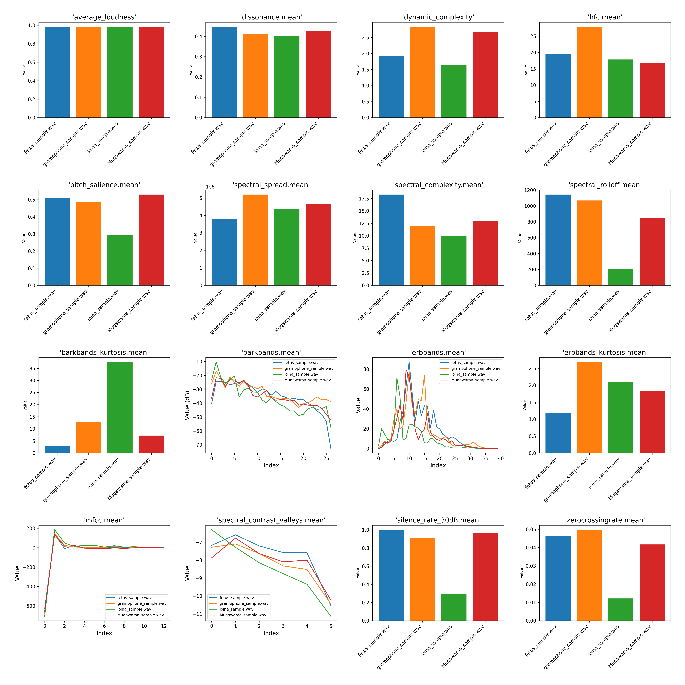
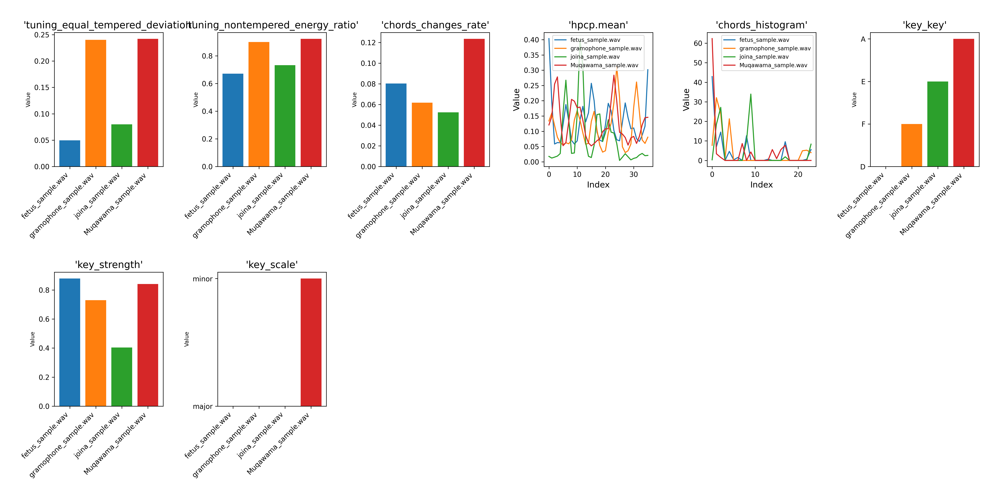

# FITM Audio Feature Analyzer

This project is a Python-based tool for analyzing audio files and extracting detailed audio features. It uses the **Essentia Streaming Extractor Music** tool to process audio files and generates a YAML file containing the extracted features. The tool also includes functionality to parse the YAML file and visualize specific features using Python.

---

## Features
- **Audio Feature Extraction**: Extracts low-level, rhythm, tonal, and other audio features from audio files.
- **Real-Time Output Streaming**: Streams the output of the external executable in real-time.
- **YAML Parsing**: Parses the generated YAML file and converts it into a Python dictionary for further processing.
- **Data Visualization**: Plots specific features (e.g., `lowlevel.mean` values) using `matplotlib`.

---

## Requirements
- Python 3.7 or later
- Dependencies:
  - `pyyaml`: For parsing YAML files.
  - `matplotlib`: For plotting data.

Install the dependencies using:
```bash
pip install pyyaml matplotlib
```

---

## Usage

### 1. Prepare the Environment
- Place the audio files you want to analyze in the `samples/` directory.
- Ensure the external executable (`streaming_extractor_music.exe`) is located in the `bin/` directory. This tool is part of the [Essentia Streaming Extractor Music](https://essentia.upf.edu/streaming_extractor_music.html#music-descriptors) package.

### 2. Run the Script
Use the following command to analyze an audio file and extract features:
```bash
python audio_analyzer.py
```

### 3. Example Workflow
1. **Analyze an Audio File**:
   - The script will call the external executable to process the audio file (e.g., `samples/fetus.wav`) and generate a YAML file in the `out/` directory (e.g., `out/data_raw.yml`).

2. **Parse the YAML File**:
   - The script will parse the generated YAML file and load its contents into a Python dictionary.

3. **Visualize Features**:
   - The script will extract the `lowlevel.mean` values from the YAML file and plot them using `matplotlib`.

### 4. Customize the Script
- Modify the `bin`, `samples`, and `out` paths in the script to match your directory structure.
- Update the arguments passed to the executable as needed.

---

## Results

The following figures are generated by the script and saved in the `out` directory. Each figure visualizes manually selected features from the corresponding section (low-level, rhythm, or tonal). These features were chosen for their relevance in describing specific audio characteristics.

---

### 1. Low-Level Features
**File**: `out/manually_selected_lowlevel_features_comparison.png`

This figure compares manually selected low-level features across the processed audio files. Low-level features describe the fundamental characteristics of the audio signal, such as its spectral and temporal properties. The selected features include:

- **Spectral Centroid**: Represents the "center of mass" of the spectrum, often associated with the perceived brightness of the sound.
- **Spectral Flatness**: Measures how noise-like a sound is, with higher values indicating a flatter spectrum (more noise-like).
- **ERB Bands Crest**: Indicates the sharpness or peakiness of the energy in the ERB bands, which can reflect the dynamic range of the sound.
- **Dynamic Complexity**: Measures the variation in loudness over time, providing insight into the dynamic range of the audio.
- **Dissonance**: Quantifies the perceived roughness or harshness of the sound, which can indicate the level of harmonic tension.
- **ERB Bands Flatness (in dB)**: Represents the flatness of the energy distribution across ERB bands, with higher values indicating a more uniform energy distribution.
- **Barkbands**: Represents the energy distribution across critical bands of hearing (Bark scale). These bands are useful for analyzing the spectral content of the audio in a way that aligns with human auditory perception.
- **MFCC (Mel-Frequency Cepstral Coefficients)**: Encodes the spectral shape of the audio signal in a compact form. MFCCs are widely used in audio and speech processing tasks, such as speaker recognition and music classification.
- **Pitch Salience**: Measures the prominence of the pitch in the audio signal. Higher values indicate a stronger and more defined pitch, which is useful for analyzing tonal clarity and harmonic content.

These features are useful for analyzing the timbre, texture, and dynamic properties of the audio signal.



---

### 2. Rhythm Features
**File**: `out/manually_selected_rhythm_features_comparison.png`

This figure compares manually selected rhythm features across the processed audio files. Rhythm features describe the temporal structure of the audio, including its beat and tempo characteristics. The selected features include:

- **Beats Loudness**: Represents the loudness of the detected beats, which can indicate the energy of the rhythm.
- **Tempo**: The estimated tempo of the audio in beats per minute (BPM), providing insight into the speed of the rhythm.
- **Onset Rate**: Measures the rate of detected onsets (sudden increases in energy), which can reflect the percussive nature of the audio.

These features are essential for understanding the rhythmic patterns and dynamics of the audio.


---

### 3. Tonal Features
**File**: `out/manually_selected_tonal_features_comparison.png`

This figure compares manually selected tonal features across the processed audio files. Tonal features describe the harmonic and melodic content of the audio. The selected features include:

- **HPCP (Harmonic Pitch Class Profile)**: Represents the harmonic content of the audio, capturing the intensity of each pitch class (e.g., C, C#, D, etc.) in a chromatic scale.
- **Chords Histogram**: Shows the distribution of detected chords over time, providing insight into the harmonic progression of the audio.
- **THPCP (Tonal Harmonic Pitch Class Profile)**: A variant of HPCP that includes temporal information, capturing changes in harmonic content over time.

These features are valuable for analyzing the harmonic structure and tonal characteristics of the audio.



---

### Summary

The selected features provide a comprehensive overview of the audio's characteristics:
- **Low-Level Features**: Focus on the timbre and texture of the sound.
- **Rhythm Features**: Highlight the temporal and rhythmic structure.
- **Tonal Features**: Capture the harmonic and melodic content.

These visualizations allow for easy comparison of audio files based on their key characteristics, making the tool useful for tasks such as audio classification, music analysis, and sound design.

---

## Example Output
- **Real-Time Output**: The script streams the output of the external executable in real-time.
- **Parsed Data**: The parsed YAML data is printed to the console.
- **Visualization**: A bar chart of `lowlevel.mean` values is displayed.

---

## Reference
This project uses the [Essentia Streaming Extractor Music](https://essentia.upf.edu/streaming_extractor_music.html#music-descriptors) tool, which is part of the [Essentia](https://essentia.upf.edu/) library developed by the Music Technology Group at Universitat Pompeu Fabra, Barcelona. Essentia is an open-source library for audio analysis and audio-based music information retrieval.

---

## Directory Structure
```
fitm_audio_analyzer/
├── bin/
│   └── streaming_extractor_music.exe  # External executable
├── samples/
│   └── fetus.wav                      # Example audio file
├── out/
│   └── data_raw.yml                   # Extracted features (YAML file)
│   └── manually_selected_lowlevel_features_comparison.png
│   └── manually_selected_rhythm_features_comparison.png
│   └── manually_selected_tonal_features_comparison.png
├── audio_analyzer.py                  # Main script
└── README.md                          # Project documentation
```

---

## Notes
- Ensure the external executable is compatible with your operating system.
- If you encounter permission issues with GitHub, ensure the correct GitHub account is configured for your repository.

---

## License
This project is licensed under the MIT License. See the `LICENSE` file for details.